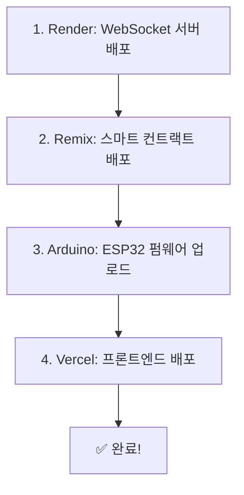

# 🚗 Base Revolt MVP

> Web3와 현실을 연결하는 실물 연동 AR 게이밍 플랫폼

ESP32-CAM 기반 RC카를 웹에서 실시간으로 조종하고, Base 블록체인으로 플레이 티켓을 구매하는 풀스택 Web3 애플리케이션입니다.

---

## 📋 목차

1. [프로젝트 구조](#프로젝트-구조)
2. [기술 스택](#기술-스택)
3. [빠른 시작](#빠른-시작)
4. [배포 가이드](#배포-가이드)
5. [하드웨어 조립](#하드웨어-조립)
6. [트러블슈팅](#트러블슈팅)

---

## 📁 프로젝트 구조

```
Base Revolt/
├── hardware/              # ESP32-CAM 펌웨어
│   ├── esp32_rc_car.ino  # Arduino 코드
│   └── README.md
├── server/               # WebSocket 서버 (Node.js)
│   ├── index.js
│   ├── package.json
│   └── render.yaml       # Render 배포 설정
├── contracts/            # 스마트 컨트랙트 (Solidity)
│   ├── TicketSale.sol
│   └── README.md
└── frontend/             # React 웹앱
    ├── src/
    │   ├── pages/
    │   ├── components/
    │   └── config/
    ├── package.json
    └── vite.config.js
```

---

## 🛠️ 기술 스택

### 하드웨어
- **ESP32-CAM** - 영상 스트리밍 및 WiFi 통신
- **L298N** - 모터 드라이버
- **RC카 섀시** - 2륜 구동

### 백엔드
- **Node.js** - WebSocket 서버
- **ws** - WebSocket 라이브러리
- **Render** - 서버 호스팅 (무료)

### 프론트엔드
- **React** - UI 프레임워크
- **Vite** - 빌드 도구
- **OnchainKit** - Coinbase Web3 라이브러리
- **Wagmi** - Ethereum React Hooks
- **React Router** - 페이지 라우팅
- **Vercel** - 프론트엔드 호스팅 (무료)

### 블록체인
- **Solidity** - 스마트 컨트랙트
- **Base Mainnet** - L2 블록체인
- **Remix IDE** - 컨트랙트 배포

---

## 🚀 빠른 시작

### 1️⃣ 하드웨어 준비

필요한 부품:
- ESP32-CAM 모듈
- L298N 모터 드라이버
- RC카 섀시 (DC 모터 2개 포함)
- FTDI USB 어댑터 (펌웨어 업로드용)
- 배터리 (7-12V)

회로 연결:
```
ESP32-CAM          L298N
GPIO 12    →      IN1
GPIO 13    →      IN2
GPIO 14    →      IN3
GPIO 15    →      IN4
5V         →      VCC
GND        →      GND
```

자세한 조립 방법: [hardware/README.md](hardware/README.md)

### 2️⃣ 서버 배포 (Render)

1. **Render 가입**: https://render.com
2. **New Web Service** 생성
3. GitHub 리포지토리 연결
4. 설정:
   - **Environment**: Node
   - **Root Directory**: `server`
   - **Build Command**: `npm install`
   - **Start Command**: `npm start`
5. Deploy 클릭
6. 배포 완료 후 URL 복사 (예: `https://your-app.onrender.com`)

자세한 가이드: [server/README.md](server/README.md)

### 3️⃣ 스마트 컨트랙트 배포 (Base)

1. **Remix IDE** 접속: https://remix.ethereum.org
2. `contracts/TicketSale.sol` 파일 복사
3. Solidity 컴파일러 0.8.20 선택 후 컴파일
4. MetaMask에서 **Base Mainnet** 선택
5. Deploy & Run Transactions에서 배포
6. 배포된 컨트랙트 주소 복사

자세한 가이드: [contracts/README.md](contracts/README.md)

### 4️⃣ ESP32 펌웨어 업로드

1. **Arduino IDE** 설치
2. ESP32 보드 매니저 설치
3. 필요한 라이브러리 설치:
   - WebSockets by Markus Sattler
   - ArduinoJson by Benoit Blanchon
4. `hardware/esp32_rc_car.ino` 파일 열기
5. 코드 수정:
   ```cpp
   const char* ssid = "YOUR_WIFI_SSID";
   const char* password = "YOUR_WIFI_PASSWORD";
   const char* ws_host = "your-app.onrender.com"; // Render URL
   ```
6. FTDI로 ESP32 연결 후 업로드

자세한 가이드: [hardware/README.md](hardware/README.md)

### 5️⃣ 프론트엔드 배포 (Vercel)

1. **OnchainKit API Key** 발급: https://portal.cdp.coinbase.com/
2. `frontend/src/config/contracts.js` 수정:
   ```javascript
   export const TICKET_CONTRACT_ADDRESS = "0x..."; // 배포한 컨트랙트 주소
   export const WS_SERVER_URL = "wss://your-app.onrender.com"; // Render URL
   ```
3. **Vercel** 가입: https://vercel.com
4. GitHub 리포지토리 Import
5. 설정:
   - **Framework**: Vite
   - **Root Directory**: `frontend`
6. 환경 변수 추가:
   - `VITE_ONCHAINKIT_API_KEY`: OnchainKit API Key
   - `VITE_WS_SERVER_URL`: `wss://your-app.onrender.com`
7. Deploy 클릭

자세한 가이드: [frontend/README.md](frontend/README.md)

---

## 🎮 사용 방법

### 1. 웹 앱 접속
Vercel 배포 URL로 접속 (예: `https://your-app.vercel.app`)

### 2. 지갑 연결
"Connect Wallet" 버튼 클릭 → Coinbase Wallet 연결

### 3. 티켓 구매
"티켓 구매하기" 버튼 클릭 → $0.5 결제 (10분 플레이)

### 4. RC카 조종
- **키보드**: W/A/S/D 또는 방향키
- **터치**: 화면 버튼 (가로/세로 모드 지원)
- **실시간 영상**: ESP32-CAM 카메라 뷰
- **화면 회전**: 가로/세로 모드 전환 가능

### 5. 데모 모드
결제 없이 "데모 체험하기" 클릭 → UI만 체험 가능

---

## 📦 배포 가이드

### 전체 배포 순서



### 배포 체크리스트

- [ ] Render 서버 배포 완료
- [ ] Render URL 복사 (WebSocket 주소)
- [ ] Base 메인넷에 스마트 컨트랙트 배포
- [ ] 컨트랙트 주소 복사
- [ ] ESP32 펌웨어에 WiFi + WebSocket URL 입력
- [ ] ESP32에 펌웨어 업로드
- [ ] OnchainKit API Key 발급
- [ ] 프론트엔드 설정 파일 업데이트
- [ ] Vercel 배포 + 환경 변수 설정
- [ ] 전체 시스템 테스트

---

## 🔧 하드웨어 조립

### 필요한 부품

| 부품 | 수량 | 예상 가격 |
|------|------|----------|
| ESP32-CAM | 1 | $10 |
| L298N 모터 드라이버 | 1 | $5 |
| RC카 섀시 | 1 | $15 |
| FTDI 어댑터 | 1 | $5 |
| 배터리 | 1 | $10 |
| 점퍼 케이블 | 1세트 | $3 |
| **총합** | | **~$48** |

### 회로도

```
         ESP32-CAM
            |
            | (WiFi)
            |
         L298N
         /    \
    Motor1  Motor2
```

자세한 배선도: [hardware/README.md](hardware/README.md)

---

## 🐛 트러블슈팅

### ESP32 관련

**Q: 카메라 초기화 실패**
- A: 5V 전원 확인 (3.3V는 부족)

**Q: WiFi 연결 안됨**
- A: 2.4GHz WiFi만 지원 (5GHz 불가)

**Q: WebSocket 연결 실패**
- A: Render URL이 `wss://`로 시작하는지 확인

### 프론트엔드 관련

**Q: 지갑 연결 안됨**
- A: OnchainKit API Key 확인, Base 네트워크 선택

**Q: 티켓 구매 실패**
- A: 컨트랙트 주소 확인, Base ETH 잔액 확인

**Q: 영상 안보임**
- A: RC카가 켜져있는지, WebSocket 연결 확인

**Q: 세로 모드에서 버튼 안보임**
- A: 화면 회전 버튼(🔄) 클릭하여 세로 모드 전환

**Q: 조종이 안됨**
- A: WASD 키보드 또는 화면 버튼 사용, WebSocket 연결 상태 확인

### 서버 관련

**Q: Render 서버 sleep**
- A: 무료 플랜은 15분 비활성 시 sleep → 첫 연결 시 재시작 대기

---

## 💡 개발 팁

### 로컬 개발

**서버 로컬 실행:**
```bash
cd server
npm install
npm start
# ws://localhost:8080
```

**프론트엔드 로컬 실행:**
```bash
cd frontend
npm install
npm run dev
# http://localhost:3000
```

**로컬 테스트 모드:**
- 개발 환경에서 "Skip Payment" 버튼 사용 가능
- 프로덕션에서는 실제 결제만 가능

**ESP32 테스트:**
- 로컬 개발 시 `ws_host`를 본인 PC IP로 변경
- 예: `192.168.1.100`

### 비용 절약

- **Render 무료티어**: 750시간/월 (충분함)
- **Vercel 무료티어**: 100GB 대역폭/월
- **Base 가스비**: 트랜잭션당 ~$0.01

---

## 📚 참고 자료

### 공식 문서
- [ESP32-CAM 가이드](https://randomnerdtutorials.com/esp32-cam-video-streaming-face-recognition-arduino-ide/)
- [OnchainKit Docs](https://onchainkit.xyz/)
- [Base Network](https://base.org/)
- [Wagmi Documentation](https://wagmi.sh/)

### 커뮤니티
- [Discord](#) (준비 중)
- [GitHub Issues](https://github.com/your-repo/issues)

---

## 📄 라이센스

MIT License

---

## 🤝 기여

기여는 언제나 환영합니다!

1. Fork the repository
2. Create your feature branch
3. Commit your changes
4. Push to the branch
5. Create a Pull Request

---

## 👤 개발자

1인 개발 프로젝트

---

## 🎯 로드맵

### MVP (현재)
- [x] ESP32-CAM 영상 스트리밍
- [x] 원격 RC카 조종 (키보드 + 터치)
- [x] 가로/세로 모드 지원
- [x] Base 결제 시스템
- [x] 10분 타이머
- [x] 로컬 테스트 모드 (Skip Payment)

### Phase 2 (계획)
- [ ] AR 아이템 오버레이
- [ ] 멀티플레이어 레이싱
- [ ] NFT 소유권 증명
- [ ] 리더보드

### Phase 3 (미래)
- [ ] Builder Mode (샌드박스)
- [ ] C2E (Create-to-Earn)
- [ ] 글로벌 아레나

---

**🚗 Let's Revolt! 🚙**

